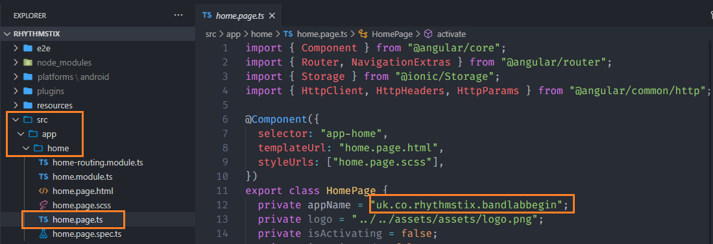
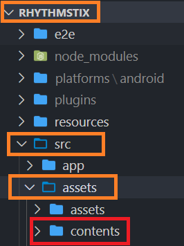

# Build And Deploy ANDROID App

## Preparation

### if ionic app not configured

1. download the source from : https://github.com/mbash12/reverse/
   

2. Extract downloaded ZIP file

3. Open Visual Studio Code

4. Open menu file, then click **Open Folder...** or **Open...**

5. Open folder from extracted zip file

6. Open embedded shell / terminal by pressing **CTRL** + **`** *(backtick)* key

7. Run this command : 

   ``` shell
   sudo npm install -g @ionic/cli
   sudo npm install -g @angular/cli
   npm install
   ```
   
### Prepare app

1. Open **config.xml**
   

2. Change **id** on widget element match with **app code** in **licences manager**, 
   

3. Change the **version** to higher than uploaded app version

4. Change **name** of the app inside <name> element

5. You can change other things, like **description**, author's **email**, author's **href** and **name** inside <author> element

6. Open **home.page.ts** inside **/src/app/home folder** 

7. change **appName** to match with **appCode**

   

8. Run this commands :

   ```shell
   ionic cordova platform rm android
   ionic cordova platform add android
   ```

### Prepare content

1. Copy your **contents** folder to folder **assets** inside the **src** folder in the application folder
   
2. Adjust font size, list height etc inside settings.json

## Build

1. Run this command :

   ```shell
   ionic cordova build android --prod --release
   ```

2. Location of the apk which you can upload to playsotre
   
