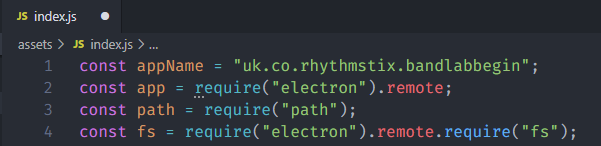
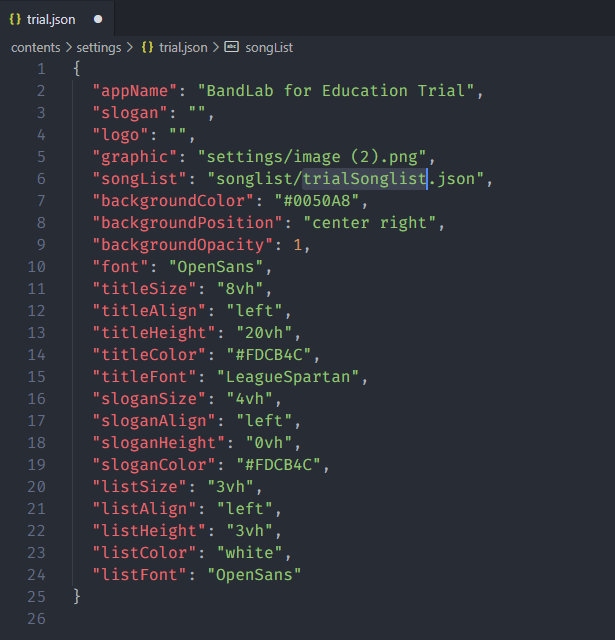
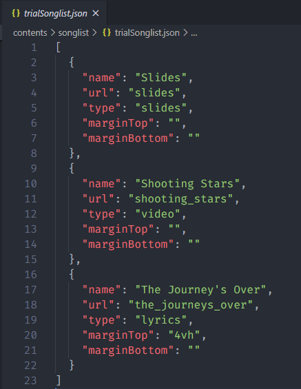
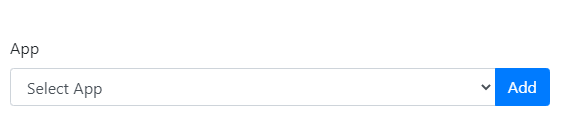
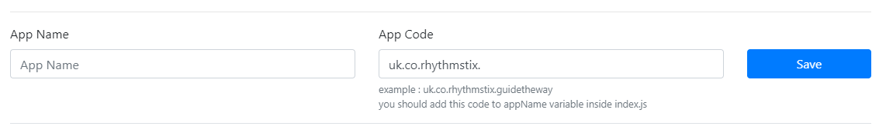
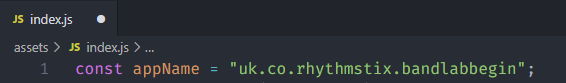
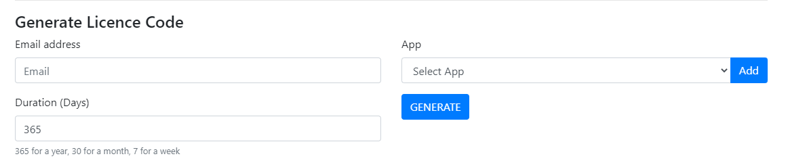
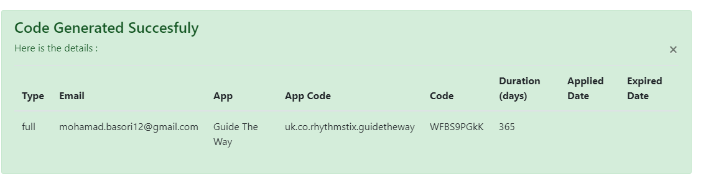

# How To Manage Licence

### Prepare The App

1.  Change appName inside index.js with this pattern : uk.co.rhythmstix.**MUSICAL_NAME**
   
2. Add trial.json inside setting folder which contain almost the same with original setting.json but you can change the content to trial licenced app, and you should change the "songList" to "songlist/trialSonglist.json"
   
3. Add trialSonglist.json inside songlist folder which contain same format with original songlist but the item you can choose which item is for trial licenced app
   

### Add new app in licence manager (if the app is not exist in dropdown list)

1. go to : https://rhythmstix.co.uk/manage-licences/

2. Click add button after App dropdown inside generate licence code form
   

3. Will appear add new app form

   

4. Fill App name with readable name, and fill app code with the same text you have set to appName inside index.js
   

   

5. Click Save

### Generate Licence Code 

1. Fill The Email field with customer email, this will help you to know if user ask their licence code in case they forget their code

2. Fill Duration to specify how log app can be used by the user (in days) 

3. Select which app can use the code, if the app not exist in the list you can go to **Add new app in licence manager (if the app is not exist in dropdown list)** instruction 

   

4. Click Generate

5. Generated Code will appear below the form

   

6. If the user has applied the code, the applied date and expired date will filled automatically

