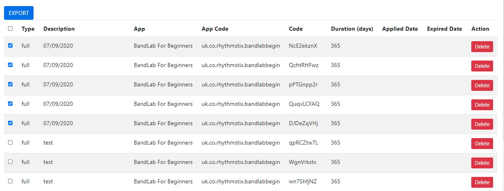
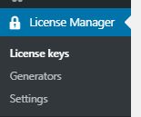
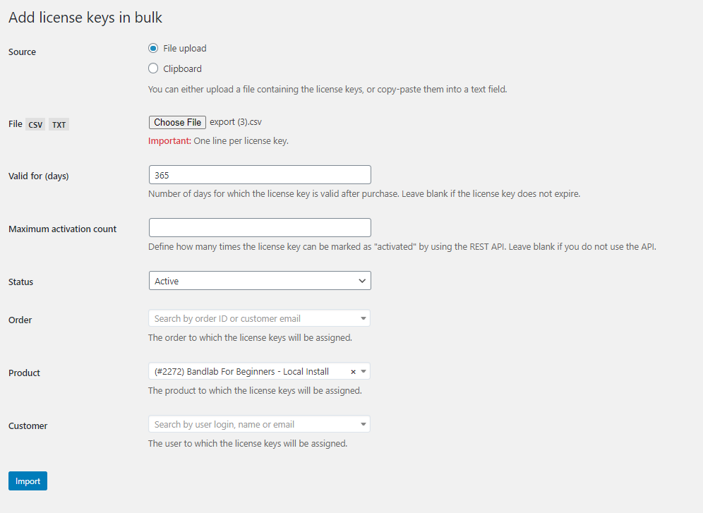
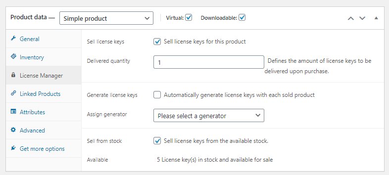
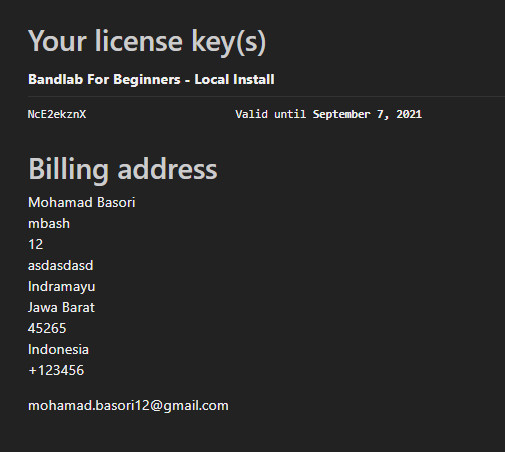
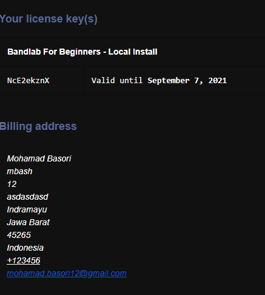

# License Management

## Generate multiple license code

1. Open https://rhythmstix.co.uk/licences/

2. input all required field :
   [image-20200907175626006](License Management.assets/image-20200907175626006.png)
1. Description (make it easier to know which license are in one group / one batch)
   2. Type : full / trial
   3. Duration : how long the license will valid since it's applied
   4. App (to specify which app this license for)
   5. Quantity (to specify how many license code will generated)
   
3. Click generate

## Export multiple license code

1. Check every license which you want to export
   

2. Click export, it will downloading a csv file

## Import multiple license code to the Wordpress

1. Login to https://rhythmstix.co.uk/wp-admin

2. Go to dashboard

3. Go to License Keys menu inside License Manager menu
   

4. Click Import
   

5. Select File upload

6. Choose the exported csv 

7. Input some data

8. Select the product will be linked
   

9. Click Import

## Link a product to the license

1. Create new product or select a product
2. Go to All Products menu inside Products menu
   
3. Select the product
4. Go to Product data section
5. Click License manager
   
6. Check Virtual and downloadable
7. Check Sell license keys
8. Check Sell license keys from the available stock
9. Click Update

## Purchased License
1. After do a purchase you will get the license inside the success page

2. And also in your email
   
