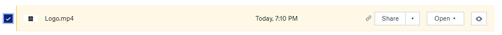
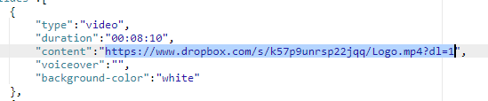
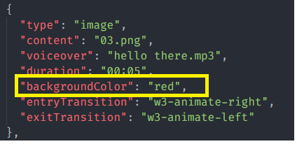
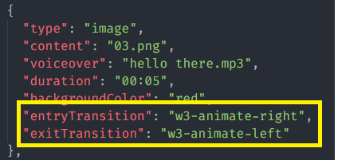
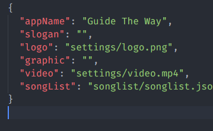
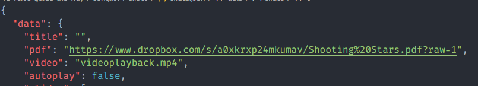

## Dropbox As Resource

1. Open dropbox

2. Click the file

3. Click Share
   

4. Click copy link
   

5. Change the link 

   from this https://www.dropbox.com/s/k57p9unrsp22jqq/Logo.mp4?**dl=0**

   to this https://www.dropbox.com/s/k57p9unrsp22jqq/Logo.mp4?**dl=1**

6. Add as content of the slide inside slides.json
   

## Auto change slide and still slide

1. set duration to "00:00" to make it still
2. set duration to any duration (example "00:25" to make it go to next slide after 25 seconds) 

## iOS and android background color

on previous setting it use background-color to make the slide background color match with image background, now it use backgroundColor instead inside slides.json

## Slide Transitions

add entryTransition and exitTransition  inside slides.json
you can use these transitions :
- w3-animate-top	
- w3-animate-bottom
- w3-animate-left
- w3-animate-right
- w3-animate-opacity
- w3-animate-zoom
- w3-animate-fading
- w3-spin

you can open this as a reference : https://www.w3schools.com/w3css/w3css_animate.asp

## Video as background of list menu

1. Open settings.json or the trial version

2. Change the graphic to "" to be 

3. Place the background video inside settings folder

4. Change video to the video file name
   

as sample : the video background name is video.mp4, so the set "video" : "settings/video.mp4"

## Demonstration Video

1. Place the video inside the slide folder, for example 1.drumatic

2. Change "video" : "" inside slides.json to "video" : "video.mp4" if the video name is video.mp4
   

## Fullscreen image slide illusion

1. Make the image background with solid color
2. set the background-color or backgroundColor with same color with the background image, you can use hex value

## Teacher instruction

1. Modify infoforteacher.html inside settings folder, this file is for displaying the list of links
2. Modify ischeme.html inside settings folder, this file is for displaying the pdf , for electron and ionic the pdf doesn't work, so you can change it with image
3. Modify plans.html inside settings folder, this file is for displaying the list of several links to files
4. Modify video.html inside settings folder, this file is for displaying the list of several links to video