# Instructions

## Make New Musical

### Make New Re-Verse Content

1. Create new folder with no special character except dash and underscore

2. Open the folder and create settings and songlist folder

3. Insert graphic and logo to settings folder if you want add those to the re-verse page

4. Create settings.json inside the settings folder which contain :
   ```json
   {
      "appName":"Audition",
      "slogan":"",
      "logo":"settings/logo.png",
      "graphic":"settings/graphic.png",
      "songList":"songlist/songlist.json"
   }
   ```
   
5. Create songlist.json inside the songlist folder which contain :
   ```json
   [
    {
        "type":"video", 			// if you want to show video page
        "name":"Shooting Stars", 	// text will appear as list
        "url":"shooting_stars" 	// folder name inside songlist folder which contain song.json
    },
    {
        "type":"lyrics", 		// if you want to show video page
        "name":"Leaving Home",	// text will appear as list item
        "url":"leaving_home" 	// folder name inside songlist folder which contain song.json
    }
   ]
   ```
   
6. Create song.json inside ~~song-folder-name~~ inside songlist folder which contain :
   ```json
   {
    "data" : {
        "title":"Shooting Stars",
        "duration":"02:50",	
       "backsong":"BACKSONG URL",
        "vocal":"VOCAL URL",
        "pdf":"PDF URL",
        "vsource":"online", // online for youtube local for dropbox
        "video":"VIDEO URL",
        "backgroundImage":"BACKGROUND URL",
        "backgroundColor":"",
        "alignment":"left"
    },
    "lyrics" : {
        "00:00.00" : {
            "section" : "Introduction",
            "singer" : "",
            "lyrics" : {
                "00:06.00" : "1  ",
                "00:07.00" : " 2  ",
                "00:08.00" : "  3  "
            }
        }  
    }
}
   ```
   For file from dropbox the url should changed to :
   
   https://www.dropbox.com/s/eu2tx17e97u3yid/shooting_stars_backsong.mp3?**dl=0**
   TO
   https://www.dropbox.com/s/eu2tx17e97u3yid/shooting_stars_backsong.mp3?**raw=1**
   
   For video only, you can skip the lyrics section, so you have to write the data section only
   
7. make the folder as a zip

### Make New Musical Page

1. Click **Add New** in **Posts** Menu 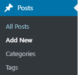
   
2. Add a title 
    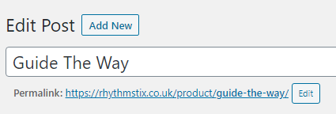
   
3. Add Excerpt
    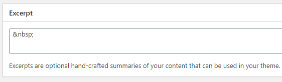
    _please add_ ```&nbsp;``` _if you want leave it blank, this text will appear below the text of musical page title in_ **music** _page_
    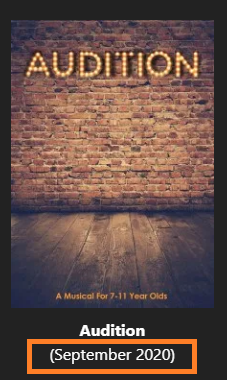
   
4. Add Content
    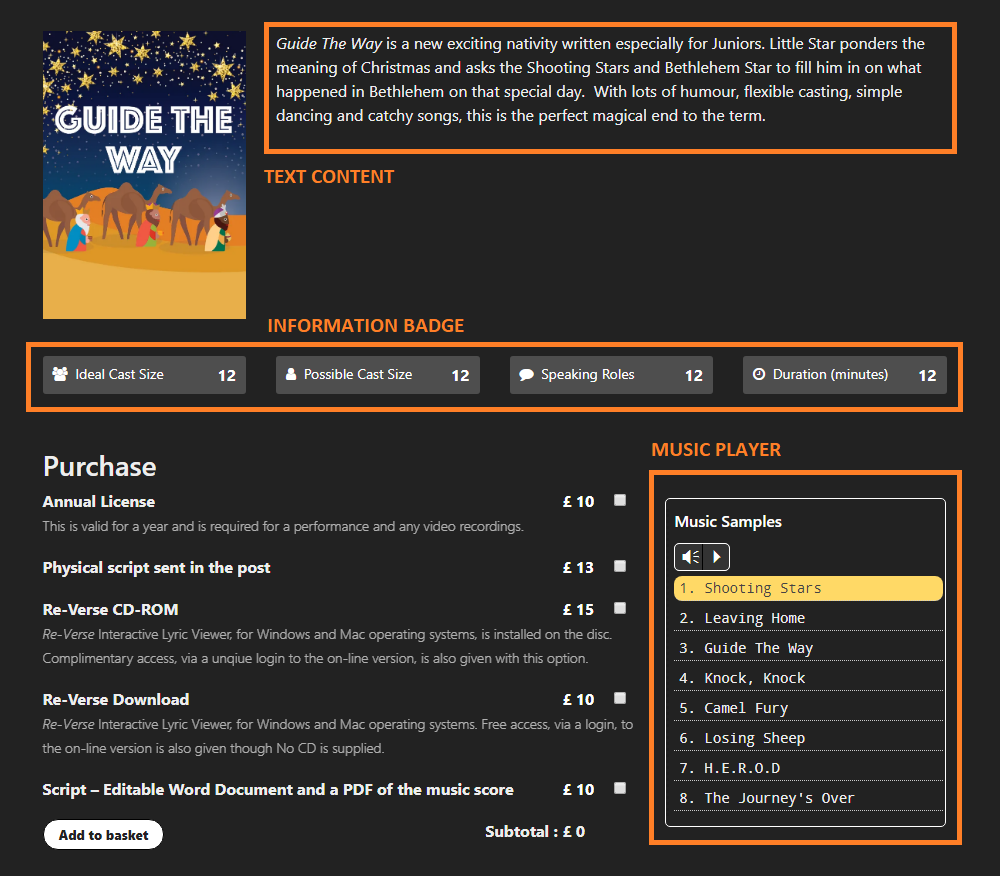
    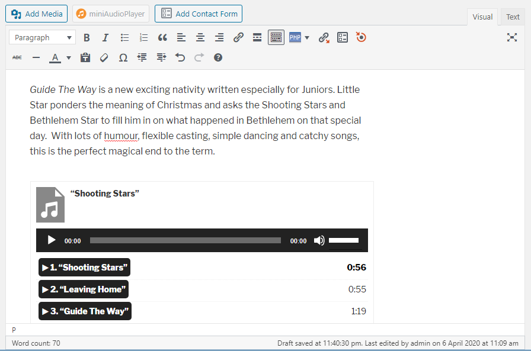
   _Click __Text__ tab in the right hand top on the content editor to add code_
   
   1. Add Text Content
      You can type your content on the content editor
   2. Add Music Player
      You can add music player shortcode inside a div with **zplayer** class
      
      ```html
      <div class="zplayer">
         [playlist ids="950,951,713,952,953,954,714,715"]
      </div>
      ```
   3. Add Information Badge
      You can add this code and change the text and value
      if you want to change the icon you can change the fa-**iconType** with any icon that you can search [here](https://fontawesome.com/icons?d=gallery&s=regular&m=free)
      
      ```html
      <div class="zbadge">
         <div class="row">
            <div class="col-md-3">
               <div class="bdg"><i class="fa fa-users"></i>  Ideal Cast Size <span class="x">12</span></div>
            </div>
            <div class="col-md-3">
               <div class="bdg"><i class="fa fa-user"></i>  Possible Cast Size <span class="x">12</span></div>
            </div>
            <div class="col-md-3">
               <div class="bdg"><i class="fa fa-comment"></i>  Speaking Roles <span class="x">12</span></div>
            </div>
            <div class="col-md-3">
               <div class="bdg"><i class="fa fa-clock-o"></i>  Duration (minutes) <span class="x">12</span></div>
            </div>
         </div>
      </div>
      ```
   Below is example of **Guide the way** content
      ```html
      <em><i>Guide The Way</i></em> is a new exciting nativity written especially for Juniors. Little Star ponders the meaning of Christmas and asks the Shooting Stars and Bethlehem Star to fill him in on what happened in Bethlehem on that special day.  With lots of humour, flexible casting, simple dancing and catchy songs, this is the perfect magical end to the term.
      <div class="zplayer">
      [playlist ids="950,951,713,952,953,954,714,715"]
      </div>
      <div class="zbadge">
      <div class="row">
      <div class="col-md-3">
      <div class="bdg"><i class="fa fa-users"></i>  Ideal Cast Size <span class="x">12</span></div>
      </div>
      <div class="col-md-3">
      <div class="bdg"><i class="fa fa-user"></i>  Possible Cast Size <span class="x">12</span></div>
      </div>
      <div class="col-md-3">
      <div class="bdg"><i class="fa fa-comment"></i>  Speaking Roles <span class="x">12</span></div>
      </div>
      <div class="col-md-3">
      <div class="bdg"><i class="fa fa-clock-o"></i>  Duration (minutes) <span class="x">12</span></div>
      </div>
      </div>
      </div>
      ```
   
5. Add Featured Image (Musical Cover) 
   1. Click **Set Featured image**
    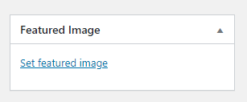
   
   2. Select the image
   3. Click **Set featured image** button
    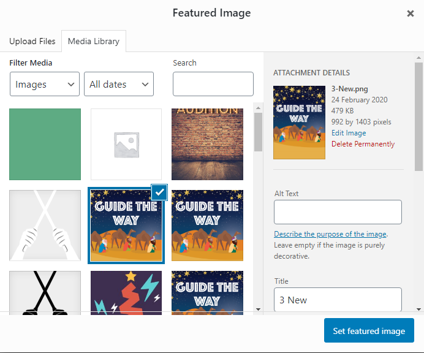
   
6. Add tag _(This will be used to retrieve purchase item data, and should be only add one tag)_
    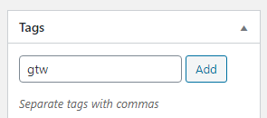
   enter tag text _example : gtw_
   click **add** button
   
7. Set category to product
   Check the **Product** category
    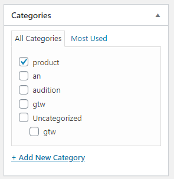
   
8. Publish the page
   Click **Publish** button
    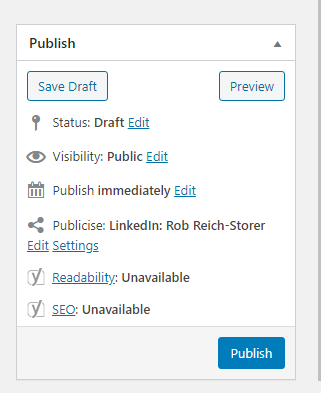
### Make New Purchase Item For Musical Page

1. Click **Add New** in **Products** Menu
    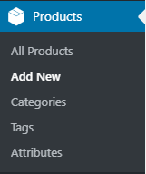
   
2. Add product name
    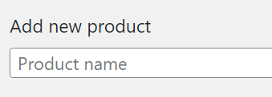
   
3. Add Product short description
    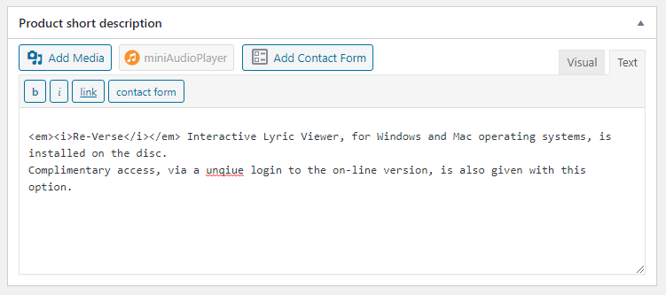
    _please add_ ```&nbsp;``` _if you want leave it blank, this text will appear below purchase item title in musical page_
    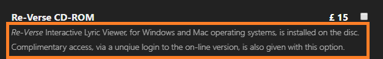
   
4. Add tag _(This should be the same with the musical page tag)_
    
   enter tag text _example : gtw_
   click **add** button
5. Add price
   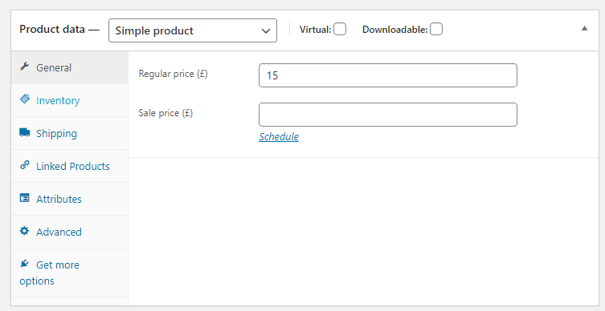
6. Set as virtual and downloadable _(if this is not a Physical product)_
   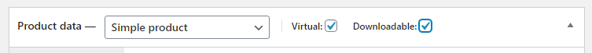
   _Check **virtual** if the product isn't posted, check **downloadable** if the product can be downloaded by the buyer, you can check both_
7. Add file to download _(if this is a downloadable product)_
   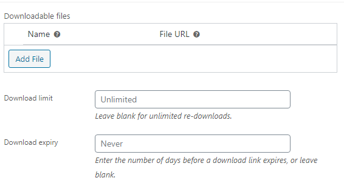
   
8. Publish the product
   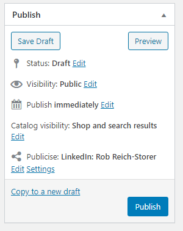
   
9. You can repeat all this step to create other purchase item for current musical page
### Upload a Re-Verse Content

1. Login to hosting account

2. Click manage on Web hosting section
   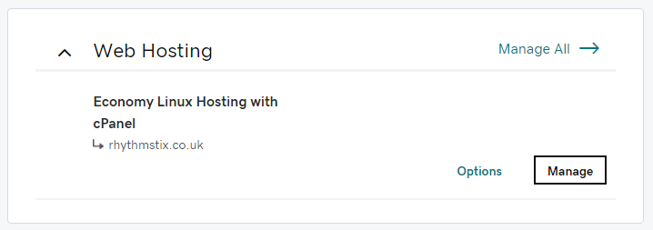
   
3. Click **cPanel Admin**
   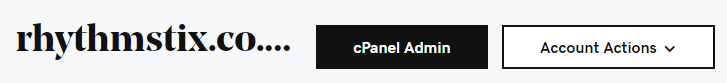
   
4. Click **File Manager** on **File** section
   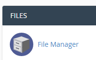
   
5. Open **public_html** > **reverse** > **contents** folder
   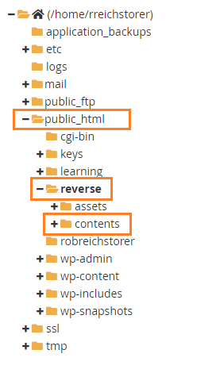
   
6. Click **Upload** button on the top panel

7. Click **Select File** button
   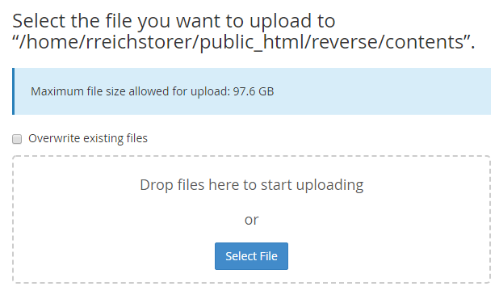
   
8. Select and upload a zip file contains a folder named with no space and any special character exclude dash " **-** " and underscore  " **_** " , below is the file and folder structure
   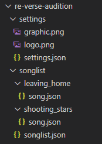
   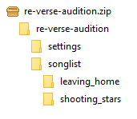
   
9. Click **go back**
   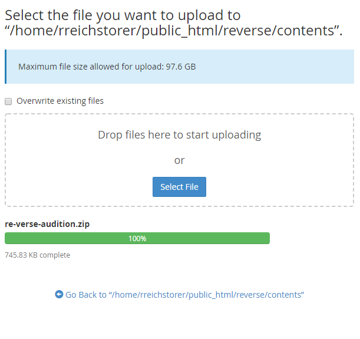

10. Right click the zip file and click **Extract** then click **Extract File(s)**
    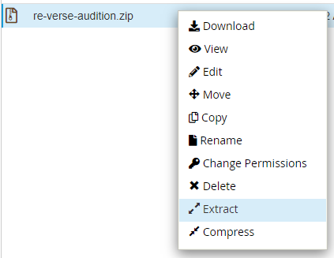


### Make New Page For Displaying Re-Verse

1. Click **Add New** in **Pages** Menu
   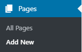
   
2. Add a title 
   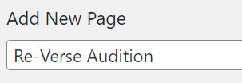
   
3. Add content
   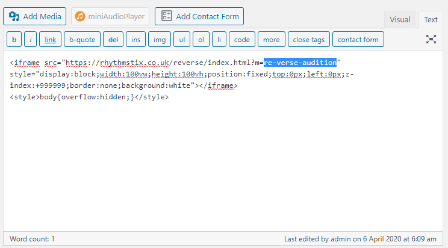
   _You have to change blocked text with folder name that you have uploaded to the **contents** folder_
   
   Below is the code :
   ```html
   <iframe src="https://rhythmstix.co.uk/reverse/index.html?m=re-verse-audition" style="display:block;width:100vw;height:100vh;position:fixed;top:0px;left:0px;z-index:+999999;border:none;background:white"></iframe>
   <style>body{overflow:hidden;}</style>
   ```
   
4. Select asosiated product (the products which have to purchased to give access to open this page)
   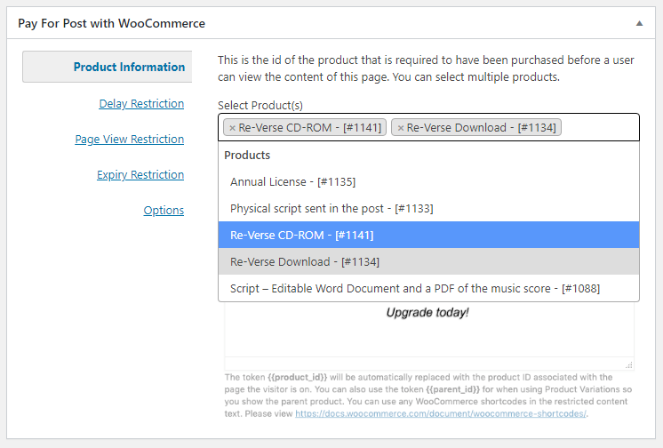

5. Change the template to **Reverse Page**
   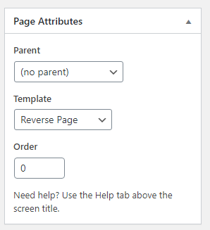

6. Publish the page 
   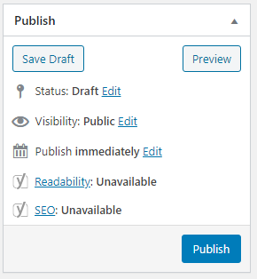


# THANK YOU FOR READING CAREFULLY
