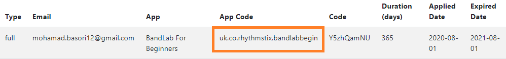

# Build Windows App

## Preparation

### Prepare the app

1. 

   ``` shell
   sudo npm install -g electron
   npm install
   ```
   
2. Open **package.json** you can change certain information below
   

3. Change **appId** on widget element match with **app code** in **licences manager**, 
   

3. Change the **version** to higher than uploaded app version

4. Change **productName** if it's different product

6. Open **index.js** inside **/assets** Folder

7. change **appName** to match with **appCode**

   


### Prepare content

1. Copy your **contents** folder 
   
2. Adjust font size, list height etc inside settings.json

## Build

1. Run this command :

   ```shell
   yarn dist
   ```

2. Location of the **exe** which you can install to windows computer
   
