# Build And Deploy IOS App

## Preparation

### if ionic app not configured

1. download the source from : https://github.com/mbash12/reverse/
   

2. Extract downloaded ZIP file

3. Open Visual Studio Code

4. Open menu file, then click **Open Folder...** or **Open...**

5. Open folder from extracted zip file

6. Open embedded shell / terminal by pressing **CTRL** + **`** *(backtick)* key

7. Run this command : 

   ``` shell
   sudo npm install -g @ionic/cli
   sudo npm install -g @angular/cli
   npm install
   ```
   
### Prepare app

1. Open **config.xml**
   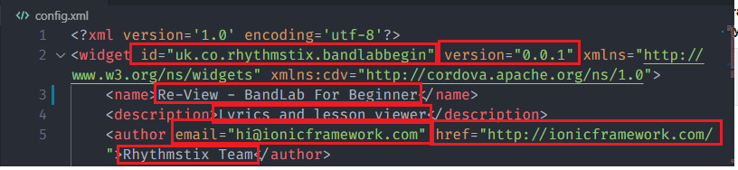

2. Change **id** on widget element match with **app code** in **licences manager**, 
   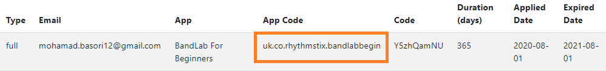

3. Change the **version** to higher than uploaded app version

4. Change **name** of the app inside <name> element

5. You can change other things, like **description**, author's **email**, author's **href** and **name** inside <author> element

6. Open **home.page.ts** inside **/src/app/home folder** 

7. change **appName** to match with **appCode**

   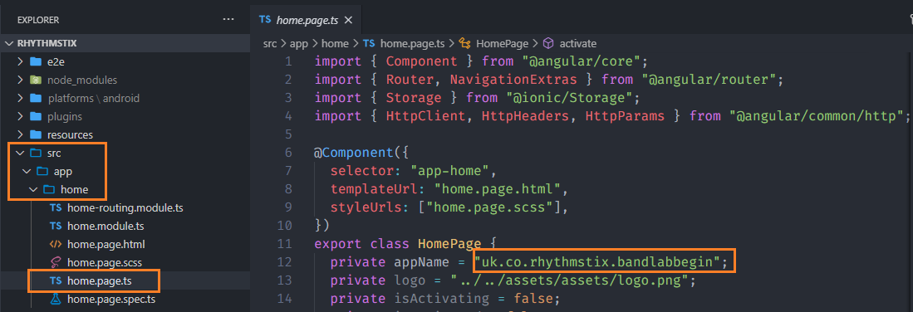

8. Run this commands :

   ```shell
   ionic cordova platform rm ios
   ionic cordova platform add ios
   ```

### Prepare content

1. Copy your **contents** folder to folder **assets** inside the **src** folder in the application folder
   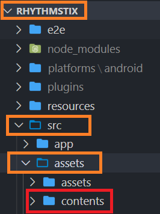

   
   
## Build

### Ionic

1. Run this command :

   ```shell
   ionic cordova prepare ios
   ```

### XCode

1. Open xcode

2. Open menu file, click open

3. Find the **ios** folder inside **/platforms** folder
   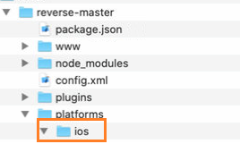

4. Click open
   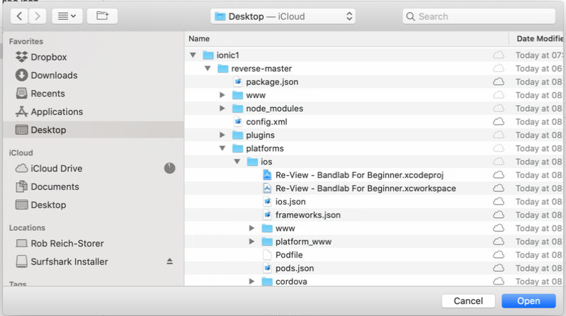

5. Click show the project navigator

6. Click the app 
   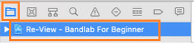

7. Select the app inside **TARGETS**
   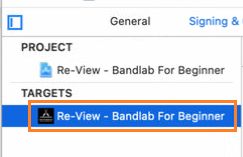

8. In **General** tab you can change these information if there are some correction
   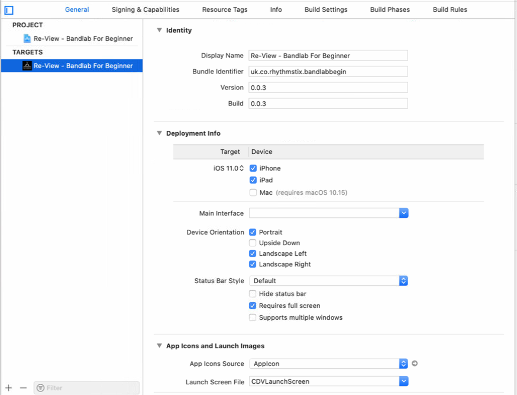

9. Click **Build Settings** tab

10. Find for **Signing** section, change the release to **iOS Developer**
      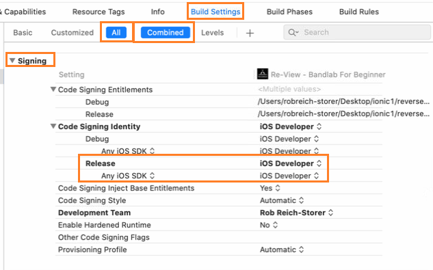

11. Click **Signing & Capabilities** tab and select the **Team**
      

12. You can test the app first before uploading the app to the store

    1. change the simulator to any device you want to test, or you can plug the real device and select it
       

    2. Click play icon to start simulation
       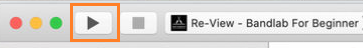

    3. And click stop to end the simulation
       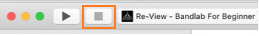

13. If everything is ok, you can change the device to **Generic iOS Device**
      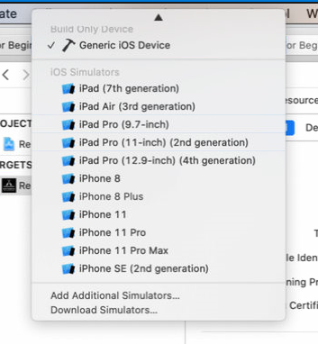

## Distribution

1. Open menu **Product** then click **Archive**
      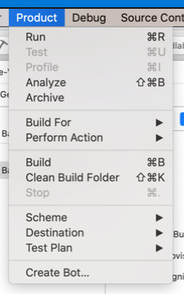
      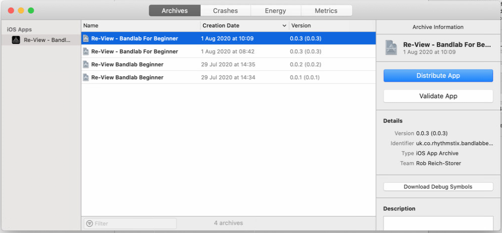

2. Click **Distribute App**

3. Select **App Store Connect**, then click **Next**
    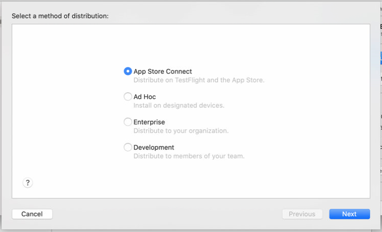

4. Select **Upload** then click **Next**
    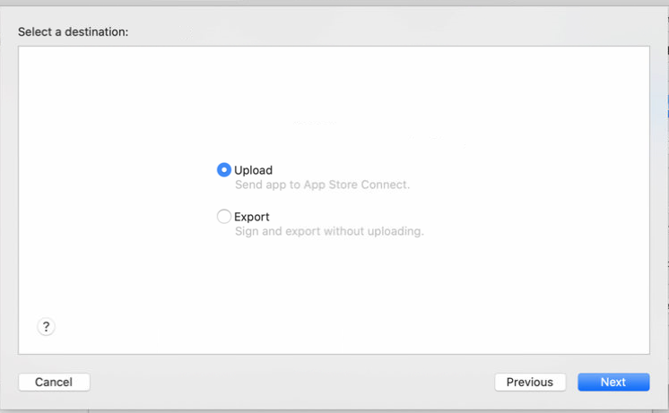

5. Click **Next**
    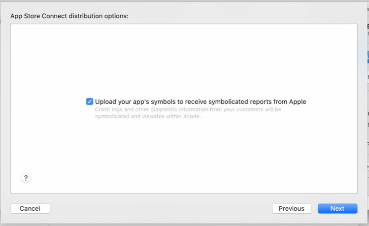

6. Select **Automatically manage signing**, then click next
    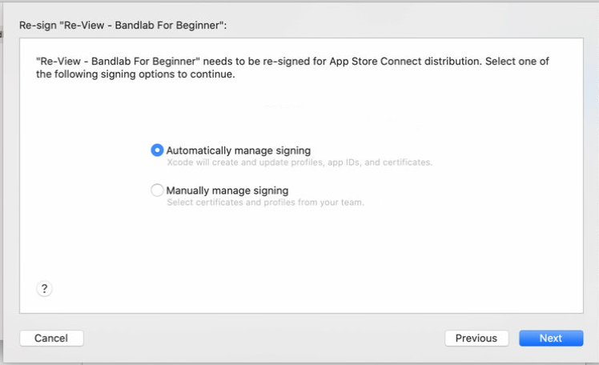

7. Click **Upload**
    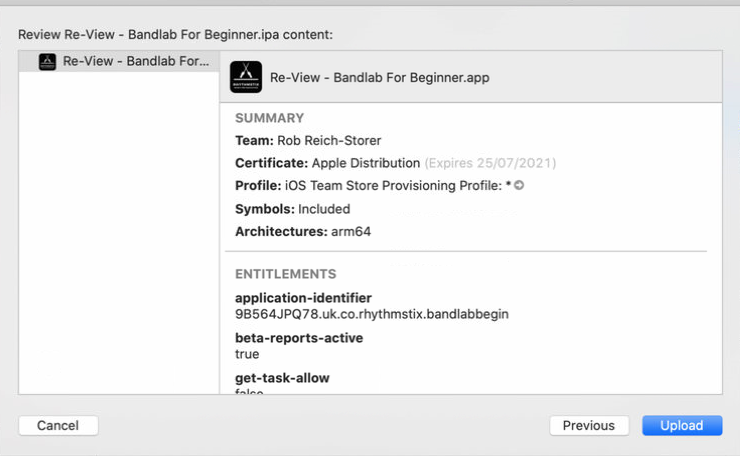


